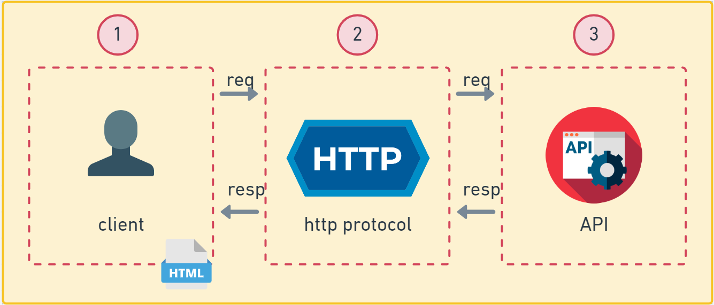

# Esquema do que será abordado

O desenho abaixo, demonstra os três passos principais da comunicação Cliente(possível front-end) - Service(backend):

1. O cliente(uma página web) faz uma **requisição(req)** 
2. Através do **protocolo http** e encaminha para a **api(nosso serviço)**.

3. Nosso serviço processa a **requisição** e devolve uma **resposta(resp)** através do protocolo http, geralmente o padrão é **JSON**(um formato padrão de objeto).

O passo seguinte é o client recebendo essa resposta e disponibilizando para o usuário.

Esses conceitos são a base para entendermos como funciona a web e como nossos serviços irão interagir.

Referências:

- [Protocolo HTTP](https://rockcontent.com/br/blog/http/)
- [HTTP - Requisição e resposta](http://protocoloti.blogspot.com/2012/11/http-requisicao-e-resposta.html#:~:text=HTTP%20%C3%A9%20o%20protocolo%20que,d%C3%A1%20a%20resposta%20ao%20cliente.&text=O%20servidor%20n%C3%A3o%20tem%20o,de%20retorno%20para%20o%20cliente.)
- [O que é Json?](https://rockcontent.com/br/blog/json/)
