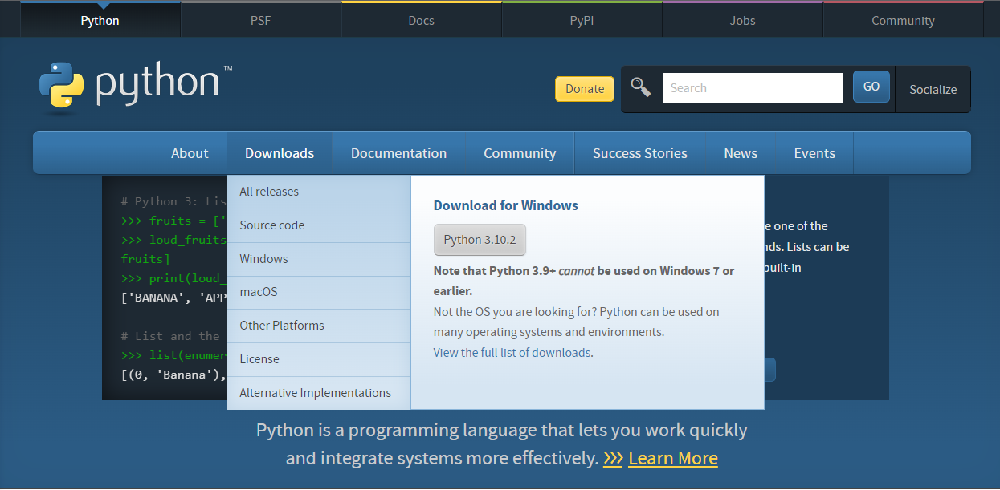
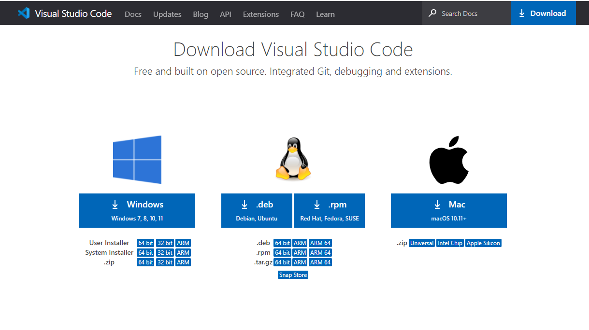

# flask beginner

## Motivação

**Este é um repositório para ajudar quem está começando com o backend de forma mais simples para mergulhar nesse mundo bem mágico(e quem quiser se aventurar com flask-python)**

## Temas Abordados
1. [Esquema do que será abordado](./01-Basic_steps/README.md)
2. [API e HTTP](./02-API_HTTP/README.md)
3. Ambiente Virtual(virtualenv)
4. Iniciando com Flask
5. API Flask
6. Organizar um projeto Flask
7. Fluxo básico do GIT (github)
## Pré-requisitos

1. Instalar o Python:
- https://www.python.org/
 
 

2. Instale um editor:
- https://code.visualstudio.com/download

